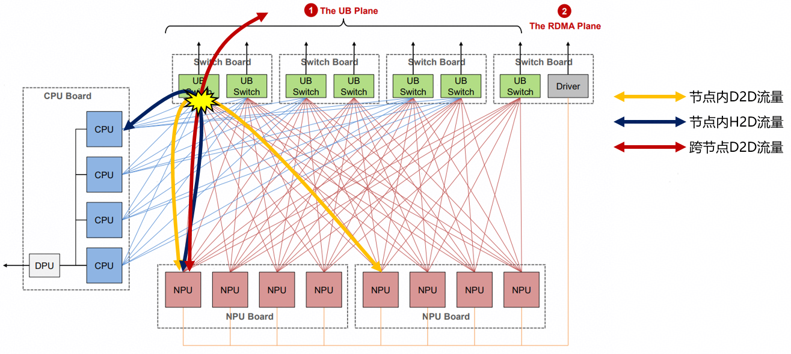
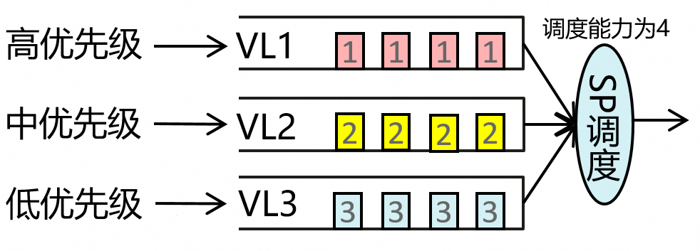
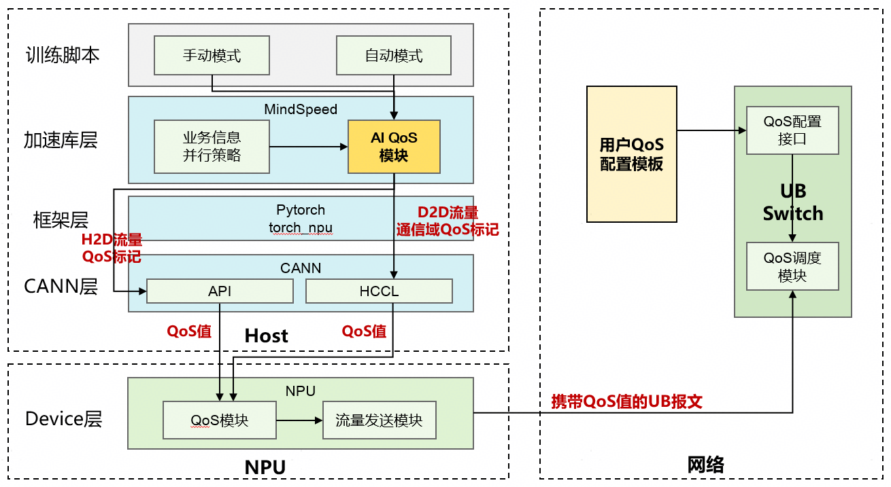

# AI QoS差异化调度特性说明

## 1 技术背景

&#12288;&#12288;面向AI大模型训练，普遍采用混合并行方式进行分布式训练，以MoE大模型为例，采用TP（张量并行）、EP（专家并行）、DP（数据并行）、PP（流水线并行）的混合并行策略。并行策略的流量在超节点内通过UB网络进行NPU与NPU之间的（D2D）通信。
&#12288;&#12288;在不同的模型切分以及模型配置下，超节点内存在不同类型的流量冲突，包括D2D（如TP、EP）流量之间，以及H2D流量（如Swap）与D2D流量之间，如图1所示，在UB Switch处，会产生incast网络冲突，产生网络拥塞，影响整体通信性能。

<div align="center">

图1 不同类型流量的流量冲突

</div>

&#12288;&#12288;由于不同流量对于算效发挥的贡献不同，某些通信流量可以通过上层相关机制实现较好的通算掩盖，如H2D的Swap流量或D2D的DP流量等，但某些流量难以掩盖或掩盖程度较低，因此可以针对不同类型流量进行差异化QoS调度，以实现算效最优的QoS映射。  
&#12288;&#12288;不同类型流量产生冲突时，在UB Switch处，可以采用虚拟通道(VL)方式进行流量隔离，并在VL间进行差异化调度，实现：

&#12288;&#12288;1）不同类型流量间的VL隔离，避免拥塞扩散     

&#12288;&#12288;2）不同流量间的差异化调度



<div align="center">
图2 一种典型的QoS调度方式——SP调度
</div>

&#12288;&#12288;如图2所示，将不同类型流量映射至不同的VL，实现流量隔离的目的，并设置不同VL的优先级，采用SP方式（Strict Priority）进行调度，则不同类型流量同时达到UB Switch时，会优先将高优先级VL调度排空后，再调度下一级队列，依此类推，以达到不同类型流量差异化调度的目的。

## 2 方案介绍

&#12288;&#12288;结合以上背景，本特性提供一种AI QoS差异化调度方案，实现：    
&#12288;&#12288;1）不同类型的流量映射至不同VL；  
&#12288;&#12288;2）VL间进行差异化调度，从而实现提高整体算效的目的。   
&#12288;&#12288;特性提供两种类型使能方式：   
&#12288;&#12288;1）自动模式，AI QoS通过感知AI大模型训练的流量类型、通信域、通信量以及算效贡献等，设计了一种算效优先的优先级映射与调度算法，并实现不同类型流量冲突度最小的VL映射以及算效优先的差异化QoS调度   
&#12288;&#12288;2）手动模式，用户可手工指定不同类型并行策略的QoS优先级，AI QoS按照用户手工指定的优先级，经过多层传递与QoS语义映射，将任务级的QoS语义转换为UB协议QoS语义，在UB报文中设置QoS值，并映射至UB Switch的相应VL，在VL间进行差异化调度。手动模式支持Low/Middle/High三档位的QoS优先级。  
&#12288;&#12288;注：H2D流量由于底层能力，只支持通道级整体QoS优先级，暂不支持算子级QoS优先级，即仅支持H2D流量与D2D等其他流量区分QoS优先级，不支持同为H2D流量的不同算子间的QoS优先级区分。   
&#12288;&#12288;方案整体架构如图3所示：


<div align="center">
图3 AI QoS差异化调度方案架构
</div>

&#12288;&#12288;D2D流量以并行策略为粒度，在创建Group时向torch_npu进行QoS标记下发，并经过CANN传递至NPU，最终按报文格式封装至UB报文中。H2D流量仅支持按通道级粒度进行全局QoS优先级设置（不包含算子下发的H2D流量），暂不支持算子粒度H2D流量的QoS优先级设置  
&#12288;&#12288;灵衢网络UB Switch已预置QoS模板，包括QoS值至VL的映射关系以及VL间的调度策略，且支持开放QoS配置模板，用户可通过配置模板人工指定QoS值至VL的映射关系以及VL间的调度策略  

## 3 使用方法

### 3.1 自动模式

&#12288;&#12288;训练脚本中添加：   
&#12288;&#12288;--aiqos&#12288;&#12288;# AI QoS特性开关      
&#12288;&#12288;--aiqos-mode auto&#12288;&#12288;# 配置AI QoS模式为自动模式      
&#12288;&#12288;自动模式当前支持TP PP DP EP CP典型并行策略

### 3.2 手动模式

&#12288;&#12288;训练脚本中添加：   
&#12288;&#12288;--aiqos&#12288;&#12288;#AI QoS特性开关   
&#12288;&#12288;--aiqos-mode manual&#12288;&#12288;#配置AI QoS模式为手动模式   
&#12288;&#12288;--aiqos-schedule {tp:high,pp:middle,dp:low}&#12288;&#12288;#  配置不同并行策略的QoS优先级   
&#12288;&#12288;如上例所示，TP优先级设置为高，PP优先级设置为中，DP优先级设置为低。   
&#12288;&#12288;手动模式当前支持dp、dp-cp、intra-dp-cp、inter-dp-cp、cp、mp、tp、pp、embd、pos-embd、tp-dp-cp、tp-dp、tp-cp、ep、ep-tp、tp-ep-mp、tp-ep-pp、ep-dp、hcp并行策略

## 4 关于DCMI接口的使用说明

### 4.1 DCMI接口使用原理介绍

&#12288;&#12288; 使用目的：A3代际NPU采用一种QoS融合策略以实现总线域NPU的QoS功能，该策略通过将控制面QoS值（通过DCMI接口下发的mpam QoS）与随路下发的细粒度QoS值（通过训练脚本下发的随路QoS）进行融合得到最终的QoS值。AI QoS特性通过调用DCMI接口以确保NPU最终接受的QoS值为AI QoS特性自动/手动模式指定的随路QoS值。此外，本接口还用于下发H2D/D2H流量的QoS值。  
&#12288;&#12288; 原理介绍：指定融合策略为取控制面QoS值与随路QoS值的最大值，并通过设置mpam QoS的水线使mpam QoS低于随路QoS，从而使融合策略最终生成的QoS值为随路QoS。  
&#12288;&#12288; 参数说明（fusion_qos）：fusion_qos中bw_low为水线下限，bw_high为水线上限,target为mpamid值,只能为0,hardlimit为0，表示不对带宽进行硬件限制。  
&#12288;&#12288; 参数说明（set_h2d_qos）：set_h2d_qos用于调整H2D流量的qos值，qos值参数与灵衢交换网络配套，支持低优先级和中优先级，对应的灵衢网络qos值为2, 4。mpamid取值为0-31，bitmap默认值为[0x1, 0, 0, 0]，表示H2D流量所在的流量通道。  

### 4.2 so编译方法

&#12288;&#12288; 进入mindspeed/ops/csrc/qos目录下，手动编译pybind11，修改目录下CMakeLists.txt中pybind11_install_dir为pybind11安装目录，执行如下命令,会在output目录下生成SO：

 ```shell
mkdir build
cd build
cmake ..
make -j
 ```

### 4.3 so使用实例

```python
import aiQos


CARD_ID_LIST = [0, 1, 2, 3, 4, 5, 6, 7]
DEVICE_ID_LIST = [0, 1]

def fusion_qos(bw_low=10, bw_high=50, target=0, hardlimit=0):
    """
    Set MPAM QoS bandwidth limit
    Parameters:
        bw_low (int): Minimum bandwidth, default value 10
        bw_high (int): Maximum bandwidth, default value 50
        target (int): Target bandwidth, default value 0
        hardlimit (int): Hard bandwidth limit, default value 0
    """
    aiQos.init()
    for card_id in CARD_ID_LIST:
        for device_id in DEVICE_ID_LIST:
            aiQos.set_gbl_qos(card_id=card_id, device_id=device_id, mode=1)
            aiQos.set_bw(
                target=target,
                bw_low=bw_low,
                bw_high=bw_high,
                hardlimit=hardlimit,
                card_id=card_id,
                device_id=device_id
            )

def set_h2d_qos(qos, mpamid, bitmap=[0x1, 0, 0, 0]):
    """
    Set QoS (Quality of Service) parameters for H2D (Host to Device) direction

    Parameters:
        qos (str): QoS level (required, string only)
                   - Only supports "low" (mapped to 2) and "middle" (mapped to 4)
                   - No integer values are allowed
        mpamid (int): MPAM (Memory Partitioning and Monitoring) ID (required, no default value)
                      Range: 0-31 (MPAM ID is a hardware resource identifier; values outside this range throw ValueError)
        bitmap (list): Bitmap parameter for QoS configuration, default value [0x1, 0, 0, 0]
                       Format: List of 4 integers, each element represents QoS control bits for different dimensions

    Raises:
        ValueError: 1. mpamid out of 0-31 range; 2. QoS string not "low"/"middle"
        TypeError: 1. mpamid not integer; 2. QoS not string type
        RuntimeError: Failed to initialize QoS module or apply QoS configuration
    """
    if not isinstance(mpamid, int):
        raise TypeError(f"mpamid must be an integer (0-31). Got type: {type(mpamid).__name__}")
    if mpamid < 0 or mpamid > 31:
        raise ValueError(f"mpamid must be between 0 and 31. Got: {mpamid}")
    if not isinstance(qos, str):
        raise TypeError(f"QoS must be a string ('low'/'middle'). Got type: {type(qos).__name__}")
    
    qos_lower = qos.lower()
    if qos_lower == "low":
        qos_numeric = 2
        print(f"Info: Mapped QoS string '{qos}' to numeric value {qos_numeric}")
    elif qos_lower == "middle":
        qos_numeric = 4
        print(f"Info: Mapped QoS string '{qos}' to numeric value {qos_numeric}")
    else:
        raise ValueError(f"QoS string only supports 'low' or 'middle'. Got: '{qos}'")

    try:
        aiQos.init()
        for card_id in CARD_ID_LIST:
            for device_id in DEVICE_ID_LIST:
                aiQos.set_gbl_qos(card_id=card_id, device_id=device_id, mode=1)
                aiQos.set_h2d_qos(
                    card_id=card_id,
                    device_id=device_id,
                    mpamid=mpamid,
                    qos=qos_numeric,
                    bitmap=bitmap
                )
    except Exception as e:
        raise RuntimeError(f"Failed to configure H2D QoS: {str(e)}") from e

fusion_qos()
set_h2d_qos('low', 20)
```

## 5 使用场景与版本配套

AI QoS特性支持Atlas 800T A3超节点服务器及Atlas 900 A3 SuperPoD集群，需以下软件版本配套：   

| 软件        | 配套版本                          |
| :---------- | :-------------------------------- |
| torch_npu   | 7.3.RC1*                          |
| CANN        | CANN 8.6*                         |
| UB Switch   | LingQu Computing Network 1.6.0*   |

*预计配套版本，具体版本待相关组件正式发布后进行更新
