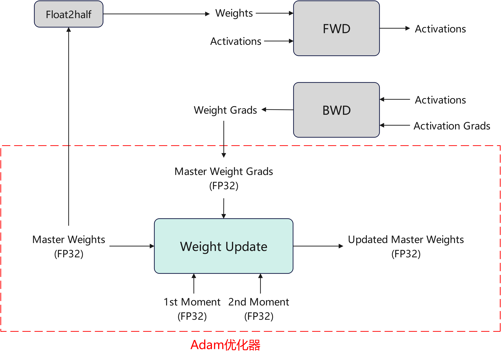
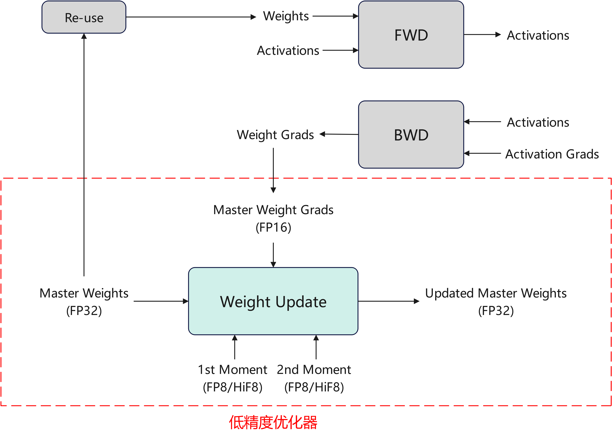
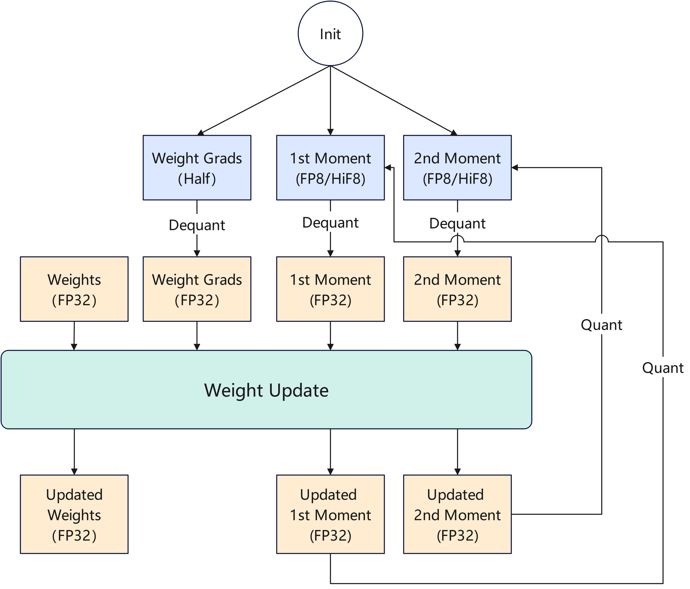

# 低精度优化器

## 问题分析

大模型训练场景中，Adam类优化器在训练过程中会使用FP32全精度数据类型持续保存参数副本，梯度和优化器的一二阶动量，造成静态内存占用较大。

## 解决方案

分别量化压缩优化器中保存的数据至低精度，以降低内存占用：

1. 将优化器内动量量化为E4M3格式的FP8或HiF8或MXFP8数据类型，降低动量内存占用。
2. 将梯度量化为半精度FP16，降低梯度内存占用。
3. 适配已有的参数副本复用算法，降低参数副本内存占用。

在优化器更新参数前，需要先将被量化的数据反量化到 FP32 以保证计算精度，计算更新完成后再量化到低精度，计算流程如下图所示：

## 使用方法

设置`--quant-states fp8`，开启优化器动量量化，量化数据类型可选`fp8`, `hif8`, `mxfp8`

设置`--quant-grads`，开启梯度量化压缩，梯度由FP32数据类型量化为FP16

兼容`reuse-fp32-param`特性

## 使用效果

降低优化器静态内存开销。
