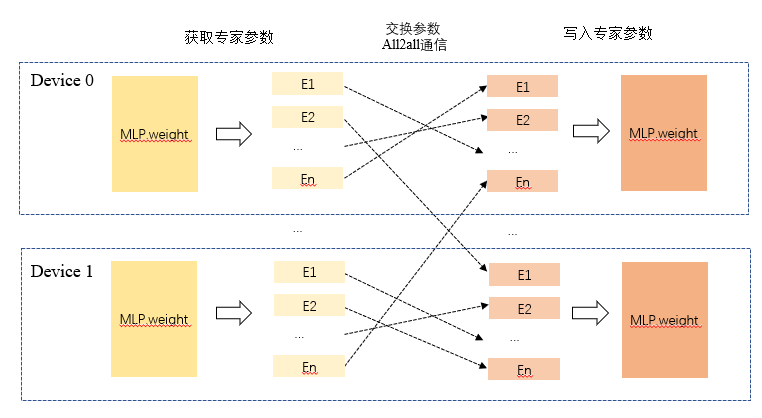

# MoE负载均衡-专家迁移

## 背景与挑战

MoE模型训练过程中专家负载具有“冷热不均”现象，尤其是预训练阶段，不同device上专家处理的token数量差异大，负载变化剧烈，造成快慢卡问题，因此拖累吞吐。
本地训练设备负载情况如下图所示，大规模训练负载情况类似。

## 解决方案

针对上述问题，提出基于专家迁移的负载均衡方案，在训练过程中以一定频率动态迁移专家，实现热专家混合搭配，可大幅缓解设备级负载不均现象，提升吞吐。方案框架如下图所示

<p align="center"> </p>

该方案主要包括规划器和执行器两部分。 
**规划器**：进行迁移准备工作，包括专家负载数据收集，负载预测和专家分配方案优化等几个部分。

* 专家负载数据收集功能集成在负载预测模块中
* 专家负载预测采取指数滑动平均（EMA）方法，计算式为
$ELP_{t+1} = \theta * ELP_{t} + (1-\theta)EL_t, $
其中，$ELP_t$为$t$步的专家负载预测， 为采集的$t$步专家负载数据，$θ$为EMA权重，一般取0.9-0.999。$θ$越大，负载预测越关注历史数据，当前负载数据影响越小。本方案中取θ=0.9，更能捕捉到当前的负载特征，基于此的专家迁移对变化负载的适应性更强。
EMA方法负载预测更新通过迭代方法处理数据，不需要保存历史负载信息，计算轻量化，预测效果也非常好。

在迁移前，在DP域对专家负载预测结果进行allreduce操作，确保所有DP域负载预测和基于该预测结果的专家分配映射关系一致。

专家分配方案优化采用贪心算法，主要步骤包括：

 &ensp; （1）初始化，每个 device 上的专家数量为 0，处理的 token 数量为 0

 &ensp; （2）根据专家负载预测结果，在专家集合中找到负载最大的专家

&ensp; （3）遍历每一个 device，找到专家数量小于预设值且处理 token 数量最少的 device

&ensp; （4）将负载最大的专家分配给上一步中的 device，并将该专家从专家集合中剔除

&ensp; （5）重复第 2 步，直至所有专家分配完成。

***执行器***：基于规划器给出的专家分配映射关系，执行专家迁移操作，将专家参数、对应的优化器状态在设备之间互相交换，同时将MoE router确定的topk专家id重映射，实现设备级负载均衡。
执行器包括分层细粒度专家迁移控制器和专家迁移操作两部分。

* 控制器通过检测专家迁移是否可以显著降低负载不均水平，来决定是否触发每层transformer中的专家迁移操作。负载不均指标设计为预测负载的变异系数，即标准差与平均值的比值，该指标为无量纲量，具有普适性。本方案中将变异系数至少下降0.08作为衡量专家迁移是否有效的标准。通过引入控制器，负载不均程度较弱的moe层不会进行专家迁移，可以降低迁移开销，尤其在sft阶段，负载比较稳定，效果更加显著。

* 专家迁移操作涉及的参数包括专家参数、优化器主参、优化器状态（一阶、二阶梯度动量）等，支持分布式优化器、参数副本复用等功能，通过alltoall通信进行设备间参数交换。

（1）专家参数交换较为简单，仅需进行参数的取出、alltoall交换、更新等操作。

<p align="center"> </p>

（2） 优化器状态交换主要步骤：
对主参、一二阶动量进行下列操作

```txt
For buffer in buffers:
    For bucket in buffer.buckets:
    1.设置缓冲区：开辟与bucket容量相同的优化器状态交换buffer
    2.写入本地状态：将bucket中参数的本地优化器状态切片写入优化器状态交换buffer
    3.执行allgather操作：对优化器状态交换buffer进行dp组内的allgather操作，得到完整的优化器状态
    4.执行alltoall操作：将本地专家参数状态从优化器状态交换buffer中取出，通过alltoall操作进行专家迁移
    5.更新本地状态：保留优化器状态交换buffer中的专家参数状态切片，并更新本地优化器状态切片
    6.释放缓冲区​​：释放临时分配的优化器状态交换缓冲区，以节省内存资源 。
```

## 使用说明

### 1. 配置参数

```bash
enable_expert_placement: True  # 专家迁移功能开关
enable_fine_grained_expert_placement: True #细粒度分层专家迁移开关，若false，则所有moe层均默认按固定频率迁移
expert_placement_freq: 50 #专家迁移频率
print_expert_load: True  #设备级专家负载打印开关
fine_grained_expert_placement_thre: 0.08 #细粒度分层专家迁移开关阈值，值越高，迁移收益要求越大
```

### 2. 功能支持与限制

支持参数副本复用（reuse_fp32_param）和分布式优化器（use_distributed_optimizer），tp_extend_ep。
