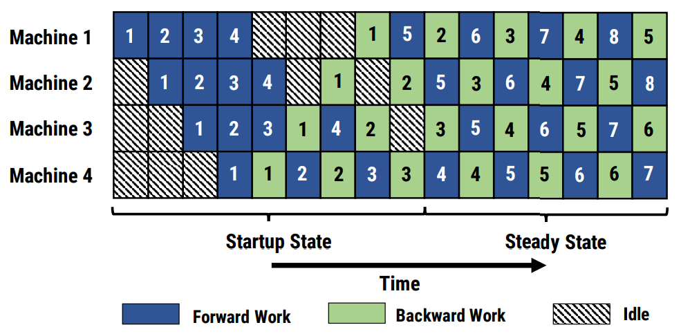

# Megatron流水线并行

## 背景与挑战

在当前大模型训练的时代背景下，单一计算设备往往无法承载整个模型的存储与计算需求。尽管模型并行策略能在一定程度上将模型分解至多台设备，实现并行训练，但在传统的模型并行模式下，各设备间存在严重的等待时间，导致计算资源利用率低下。

## 解决方案

为克服上述挑战，流水线并行（Pipeline Parallelism，PP）技术应运而生，其核心在于借鉴工业生产中的流水线理念，通过将模型划分为多个阶段（Stage），并分配至不同的计算设备上，实现前后阶段的接力式并行计算，以最大程度减少设备间的等待时间，同时缩短前向与反向计算之间的距离，从而有效降低内存消耗。

流水线并行的具体实施策略如下：

* 阶段划分：将整个神经网络模型分为多个逻辑阶段，每个阶段在不同的计算设备上执行。
* 接力式并行：各阶段之间采用接力式的并行计算方式，即当前阶段的计算结果作为下一阶段的输入，形成连续的前向与反向计算流程。
* 预热与冷却：在流水线并行训练开始时，需进行预热阶段，初始化计算流程；训练末尾则进行冷却阶段，确保所有阶段的计算任务得以完成。

### 图1 流水线并行调度示意图

具体细节可参考文献 [原文链接](https://arxiv.org/pdf/1806.03377)

## 使用场景

流水线并行技术适用于以下场景：

* 模型规模庞大：模型参数量巨大，单一设备难以承担存储与计算需求。
* 计算资源丰富：拥有充足的计算设备，能够支撑模型的阶段划分与并行计算。
* 优化存储与计算效率：旨在降低单个设备的存储开销，提升计算资源的利用率。

## 使用方法

启用流水线并行，需在训练脚本中加入以下参数配置：
`--pipeline-model-parallel-size  N      # N表示流水线并行的阶段数，即参与并行训练的NPU数量`
用户需根据实际需求进行配置，其缺省值为1。

## 使用效果

通过流水线并行策略，不仅显著提升了计算效率，减少了模型训练过程中的内存消耗，还有效优化了计算资源的分配与利用。
