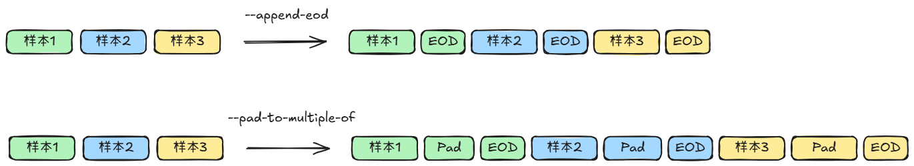

# pack模式预训练数据集处理

## 背景与挑战

在大模型的预训练任务中，一个训练批次中的输入序列通常由多个文档拼接而成。默认情况下，模型会将这些文档视为一个连续的序列，不会对它们之间的self attention进行遮挡，这意味着不同文档之间可以相互建立上下文依赖。

然而，在某些特定场景下，不同文档之间需要相互独立，不能共享上下文信息。例如，当文档之间存在语义不相关性或需要保持训练目标隔离时，必须禁止它们之间的 self attention。此时，模型需要在每个文档的结束位置（EOD）处，
重新设置attention mask和position ids，以实现文档级别的注意力隔离。为提升token的利用率，预训练过程中可以采用pack技术，即将多个较短的样本拼接成一个完整的训练序列。在此过程中，模型无法自动识别不同样本的边界，因此需要在每条样本末尾显式插入EOD token，以标识边界并指导后续的attention mask构建。

## 解决方案

MindSpeed提供了数据预处理的工具，支持构建pack模式的预训练数据集，并支持对pack模式数据集进行离线pad，加速训练过程。

### 数据集下载

数据集下载可以基于网页直接下载，也可以基于命令行下载，比如：

```shell
mkdir dataset
cd dataset/
wget https://huggingface.co/datasets/tatsu-lab/alpaca/blob/main/data/train-00000-of-00001-a09b74b3ef9c3b56.parquet
cd ..
```

### 数据集处理

#### 预训练数据集处理方法

```shell
# 请按照您的真实环境 source set_env.sh 环境变量
source /usr/local/Ascend/ascend-toolkit/set_env.sh
cd Megatron-LM
mv ../MindSpeed/tools/preprocess_data.py .
mv ../MindSpeed/tools/data_handler.py .

mkdir ./dataset

python ./preprocess_data.py \
    --input ./dataset/train-00000-of-00042-d964455e17e96d5a.parquet \
    --tokenizer-name-or-path ./model_from_hf/llama-2-7b-hf \
    --tokenizer-type PretrainedFromHF \
    --handler-name GeneralPretrainHandler \
    --output-prefix ./dataset/alpaca_llama2_7b \
    --append-eod \
    --pad-to-multiple-of 8 \
    --json-keys text \
    --workers 4 \
    --log-interval 1000  
```

#### 参数说明

- `input`：可以直接输入到数据集目录或具体文件，如果是目录，则处理全部文件, 支持`.parquet`，`.csv`，`.json`，`.jsonl`，`.txt`，`.arrow`格式， 同一个文件夹下的数据格式需要保持一致。
- `handler-name`：当前预训练默认使用 `GeneralPretrainHandler`，支持的是预训练数据风格，提取数据的`text`列，格式如下：

    ```shell
    [
        {"text": "document"},
        {"other keys": "optional content"}
    ]
    ```

- `json-keys`：从文件中提取的列名列表，默认为 `text`，可以为 `text`, `input`, `title` 等多个输入，结合具体需求及数据集内容使用，如：

    ```shell
    --json-keys text input output
    ```

- `append-eod`：该参数的作用是将文档结束标记`EOD`显示地添加到每条数据的末尾，防止模型学习无意义的关联
- `pad-to-multiple-of`：该参数的作用是将每条数据的长度pad到pad-to-multiple-of的倍数

`append-eod`和`pad-to-multiple-of`参数使能后的效果如下：


#### 处理结果

预训练数据集处理结果如下：

```shell
./dataset/alpaca_llama2_7b_text_document.bin
./dataset/alpaca_llama2_7b_text_document.idx
```

预训练时，数据集路径`--data-path`参数传入 `./dataset/alpaca_llama2_7b_text_document` 即可

## 使用场景

pack模式数据集一般在EOD Reset训练场景下使用：
（1）打开`--reset-attention-mask`选项
（2）使用`--reset-position-ids`选项，来代表位置编码是否reset
（3）`--attention-mask-type`可以指定为causal或者general

若预处理时设置了`pad-to-multiple-of`参数，可加速长序列并行中`megatron_cp_algo`选项算法在EOD Reset训练场景下的性能：

* 未设置`pad-to-multiple-of`参数：对于`--attention-mask-type`为causal的情况，因为内部实现的需求，每个子序列的长度会被在线pad到CP*lcm(2, TP)的倍数，其中lcm为最小公倍数
* 设置`pad-to-multiple-of`参数：对于同样场景，可在预处理时设置`pad-to-multiple-of = CP*lcm(2, TP)`离线将每个子序列pad到需要的长度，节约在线pad的时间，加速训练

## 注意事项

在构建pack模式数据集时，是否使能`pad-to-multiple-of`参数会导致在线训练时每个批样本中存在一定差异，因此二者在精度上并不能完全对齐
