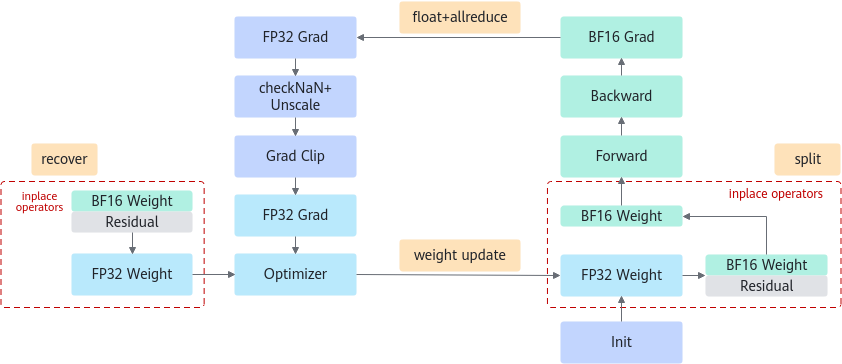
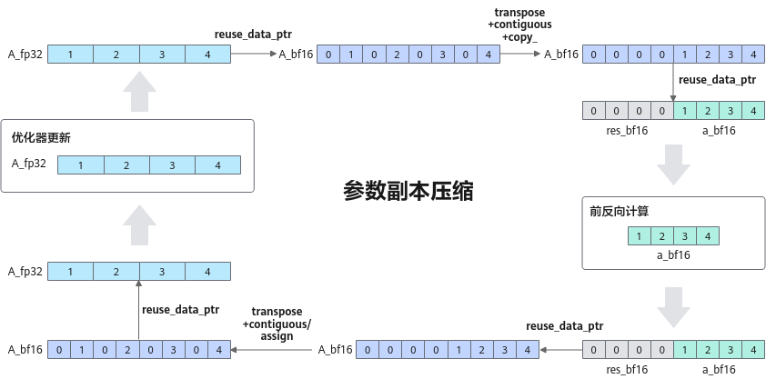

# 参数副本复用

## 背景与挑战

在当前大模型训练场景中，混合精度训练已成为标准实践，其中涉及计算权重与状态权重的持续存储。然而，这两类权重的生命周期并不重叠，这意味着它们可以共享内存空间，而非各自独立占用。通过数值变换技巧，我们能消除这一冗余，实现资源的有效利用。

## 解决方案

鉴于在大模型混合精度训练中，BF16（Brain Floating Point Format）计算参数（用于前向和后向计算）与FP32参数副本（用于参数更新）无需同时存在于内存中，且两者之间存在明确的数值对应关系，我们设计了一种内存共用算法，以优化内存使用效率。

具体算法步骤如下：

1. FP32 = BF16 + Residual；
2. 前向计算前：将FP32参数转换为BF16格式，并保存残差（Residual）；
3. 优化器更新前：基于BF16参数和之前保存的残差，恢复FP32参数至其原始状态，随后进行参数更新；
4. 数值变换模拟：利用int32加减运算来等价模拟原始逻辑中FP32与BF16之间的相互转换，遵循IEEE 754标准的向偶数舍入规则。

请参照下图了解参数副本复用的具体流程。

 

数值变化的详细逻辑如下图所示：

### 图2 数值变换的详细逻辑

 

## 使用场景

此特性适用于采用BF16数据格式进行训练的场景。通过复用FP32参数内存，减少了权重的内存占用。

## 使用方法

启用参数副本复用，需在训练脚本中加入以下参数配置：
`--reuse-fp32-param`

## 使用效果

* 对于Float16OptimizerWithFloat16Params类型的优化器，整体可节省 sizeof(bfloat16) * 模型参数量 的静态内存空间，且在多个模型上的测试表明，性能损耗低于1%。
* 对于启用了分布式优化器的训练任务，总体节省的静态内存空间为 sizeof(bfloat16) * 模型参数量 / DP，同样地，性能损耗在测试中也控制在1%以内。

## 使用约束

1. 使用legacy model训练时，`reuse_fp32_param`暂不支持和`--overlap-param-gather`一起使用。
2. 使用fused_ema_adamw优化器时，不支持同时开启`reuse_fp32_param`。
3. 断点续训场景下，不支持修改切分方式及卡数。
