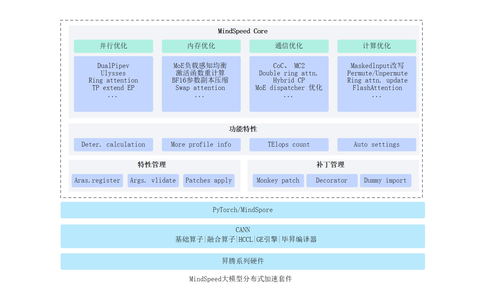

# 简介
   
## 概述

MindSpeed Core是针对华为昇腾设备的大模型加速库。大模型训练是一种非常复杂的过程，涉及到许多技术和挑战，其中大模型训练需要大量的显存资源是一个难题，对计算卡提出了不小的挑战。 为了在单个计算卡显存资源不足时，可以通过多张计算卡进行计算，业界出现了类似 Megatron、DeepSpeed 等第三方大模型加速库，对模型、输入数据等进行切分并分配到不同的计算卡上，最后再通过集合通信对结果进行汇总。昇腾提供 MindSpeed Core 加速库，使客户大模型业务能快速迁移至昇腾设备，并且支持昇腾专有算法，确保开箱可用。

## MindSpeed Core架构

MindSpeed Core 整体架构如下图，整体分为三个层次：

- 加速特性：
在并行、内存、通信、计算等多个维度提供丰富多样的加速特性；
特性内聚解耦设计，可快捷一键使能，也可方便的进行二次开发。

- 工具/功能特性：
强大易用的工具特性加速模型端到端调优过程，大幅提升开发效率；
并行策略自动搜索，以小仿大，快速给出较优并行配置。

- Patch/特性管理:
非侵入式的Patch管理，方便版本之间的快速迭代；
各类特性之间的管理独立解耦，轻便快捷的应用至自有框架。

图1 MindSpeed架构图

## 功能特性

MindSpeed 特性由七大模块组成，分别为：Megatron特性支持、并行策略特性、内存优化特性、亲和计算特性、通信优化特性、关键场景特性以及多模态特性。
