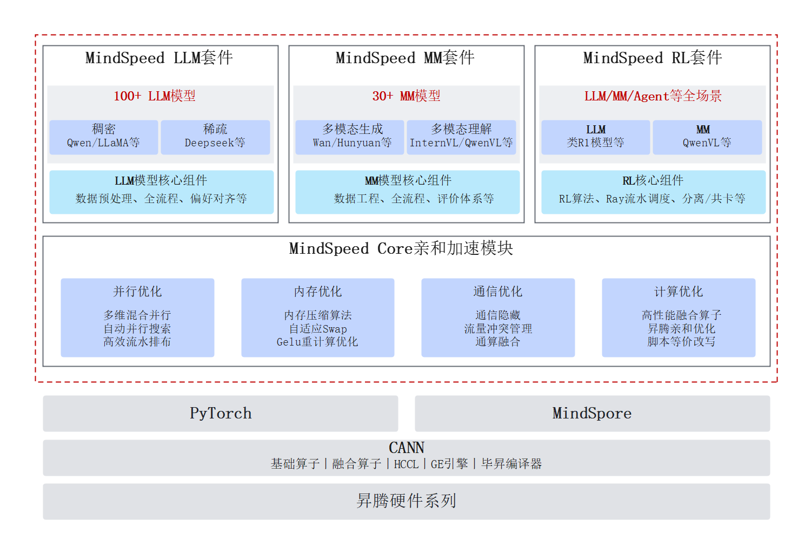

# MindSpeed是什么

MindSpeed是一款专为昇腾平台打造的高性能加速库，涵盖了MindSpeed Core亲和加速模块、MindSpeed LLM套件、MindSpeed MM套件以及MindSpeed RL套件这四个重要组成部分。

MindSpeed凭借其卓越的性能表现与深度优化的算法架构，为客户在AI领域实现大模型训练提供了强有力的支持。借助MindSpeed，用户能够充分挖掘并利用昇腾设备的高性能计算能力，加速大模型训练过程，从而在AI领域更快更好的服务用户。

## 总体架构

**图 1**  MindSpeed整体架构  

**表 1**  组件介绍

|组件名称|说明|
|--|--|
|MindSpeed Core亲和加速模块|基于昇腾设备的大模型加速模块，提供计算、内存、通信、并行四个维度的优化，支持长序列、MoE等场景加速特性。|
|MindSpeed LLM套件|基于昇腾生态的大语言模型套件。旨在提供端到端的大语言模型训练方案，包含分布式预训练、分布式指令微调以及对应的开发工具链，如：多模态数据预处理、权重转换、在线推理、基线评估，覆盖业内主流大语言模型。|
|MindSpeed MM套件|面向大规模分布式训练的昇腾多模态大模型套件，聚焦多模态生成、多模态理解，提供多模态大模型端到端训练流程，包含多模态数据预处理、训练微调、在线推理以及效果评估等能力，覆盖业内主流多模态大模型。|
|MindSpeed RL套件|提供超大昇腾集群训推共卡、异步流水调度、训推异构切分通信等核心加速能力。|

## 关键功能特性

- MindSpeed Core：
    - 并行算法优化：支持模型并行、优化器并行、专家并行、长序列并行等多维并行策略，针对昇腾软硬件架构进行亲和优化，显著提升了集群训练的性能和效率。
    - 内存资源优化：提供内存压缩、内存复用、内存交换以及差异化的重计算技术，最大限度地利用内存资源，有效缓解内存瓶颈，提升训练效率。
    - 通信性能优化：采用通算融合、通算掩盖等策略，配合高效的算网协同机制，大幅提高算力利用率，减少通信延迟，优化整体训练性能。
    - 计算性能优化：集成高性能融合算子库，结合昇腾亲和的计算优化，充分释放昇腾算力，显著提升计算效率。
    - 差异化能力支持：在长序列、权重保存、并行策略自动搜索等场景提供差异化能力。

- MindSpeed LLM：
    - 主流LLM大语言模型：支持Qwen3/DeepSeek/Mamba2系列等100+主流LLM模型，涵盖Dense/MoE/SSM等LLM架构，提供针对昇腾架构的高性能训练脚本，开箱即用。
    - 分布式预训练：支持分布式预训练，提供数据预处理方案与包含TP/PP/DP/CP/EP在内的多维并行策略。
    - 分布式指令微调：支持业界主流的全参微调/LoRA/QLoRA微调训练算法，并提供微调性能/显存优化手段。
    - 模型权重转换：支持Megatron/HuggingFace格式的权重转换和LoRA微调权重的独立/合并转换。
    - 在线推理与评估：支持模型分布式在线推理与公版数据的在线评估。

- MindSpeed MM：
    - 主流多模态模型：支持InternVL/QwenVL系列等主流多模态理解模型；支持OpenSoraPlan/CogVideoX/HunyuanVideo/Wan2.1/Wan2.2系列等主流视频生成模型；支持FLUX/SANA/HiDream/Qwen Image系列等主流文生图模型。提供针对昇腾架构的高性能训练脚本，开箱即用。
    - 分布式训练：支持分布式全参微调，提供数据预处理方案与包含异构PP/TP/SP/FSDP2等多维并行策略；通过细粒度选择性重计算和Async-offload异步卸载技术，充分利用显存、H2D、D2H等异构资源，达成了超长序列性能优化。支持LoRA微调和DPO训练。
    - 模型权重转换：支持Megatron/HuggingFace格式的权重转换和LoRA微调权重的独立/合并转换。
    - 在线推理与评估：支持模型分布式在线推理与公版数据的在线评估。

- MindSpeed RL：
    - 内存资源优化：支持训推共卡，训推最优并行的共卡切换，以及精细化的训推内存管理技术。
    - 计算流编排优化：支持异步Replay Buffer，解耦数据依赖，使能异步训练与任务流水掩盖，大幅提升端到端吞吐。
    - 负载均衡优化：支持变长序列的数据负载均衡，显著提升算力利用率和端到端的吞吐。
    - 大规模RL优化：支持千亿MoE长序列的高性能训练。

## 更多介绍

关于MindSpeed的更多介绍，可参见在线课程：[MindSpeed](https://www.hiascend.com/edu/courses?activeTab=MindSpeed)。
